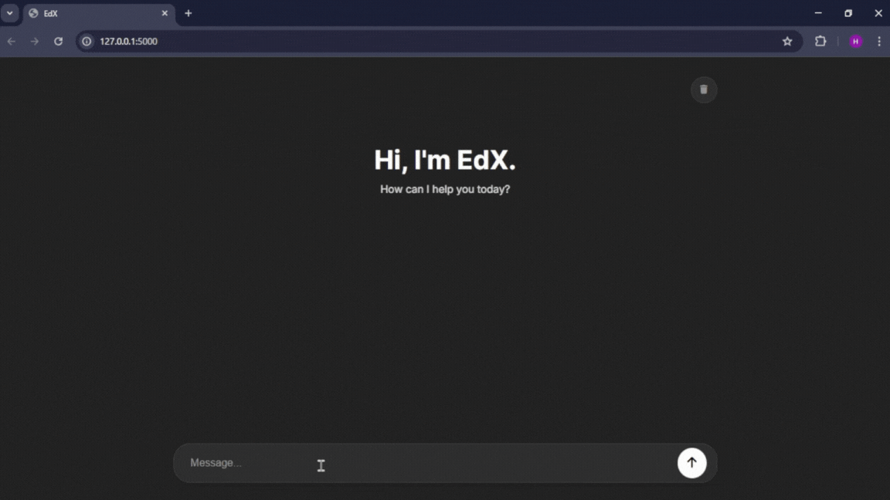

# EdX - AI Chatbot 🤖



EdX is an AI-powered conversational chatbot built using Python, JavaScript, HTML, CSS, and Flask. It leverages the Groq Cloud API to deliver fast and intelligent responses

## Features

- Interactive AI chatbot interface
- Real-time responses using Groq Cloud API
- Backend powered by Python & Flask
- Frontend built with HTML, CSS, and JavaScript
- Easy to customize and extend

## Tech Stack

- **Frontend**: HTML, CSS, JavaScript  
- **Backend**: Python (Flask)  
- **AI Integration**: Groq Cloud API  

## How to Run Locally

1. **Clone the repository**
   ```bash
   git clone https://github.com/yourusername/edx-chatbot.git
   cd edx-chatbot